<!--
**TomJo2000/TomJo2000** is a ✨ _special_ ✨ repository because its `README.md` (this file) appears on your GitHub profile.
-->

### Stuff I maintain:

<table align="center">
  <tbody align="center">
    <tr>
      <td><h5>
        <a href="https://github.com/termux/termux-packages">Termux Repos:</a>
      </h5></td>
      <td></td>
    </tr>
    <tr>
      <td></td>
      <td></td>
    </tr>
    <tr>
      <td></td>
      <td></td>
    </tr>
    <tr>
      <td></td>
      <td></td>
    </tr>
    <tr>
      <td></td>
      <td></td>
    </tr>
  </tbody>
</table>

### Metrics

<!-- vim: set ft=markdown et tw=2 sw=2 ff=unix -->
